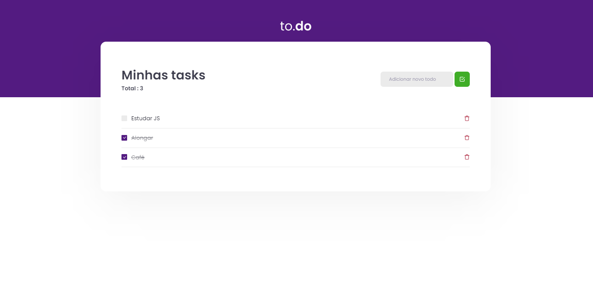

<h1 align="center">
    
</h1>

<h4 align="center"> 
	🚀 Desafio 01 - Conceitos do React  🚀 
</h4>

# 💻 About

In this challenge, you must create an application to train what you have learned so far in ReactJS

This will be an application where your main objective is a small application of activities to do, to train a little more about the manipulation of the state in React.

- Add a new task
- Task remover
- Mark and unmark a task as completed

Below we will see in more detail what and how it needs to be done. 🚀

# My preview

<h1 align="center">
    
</h1>
